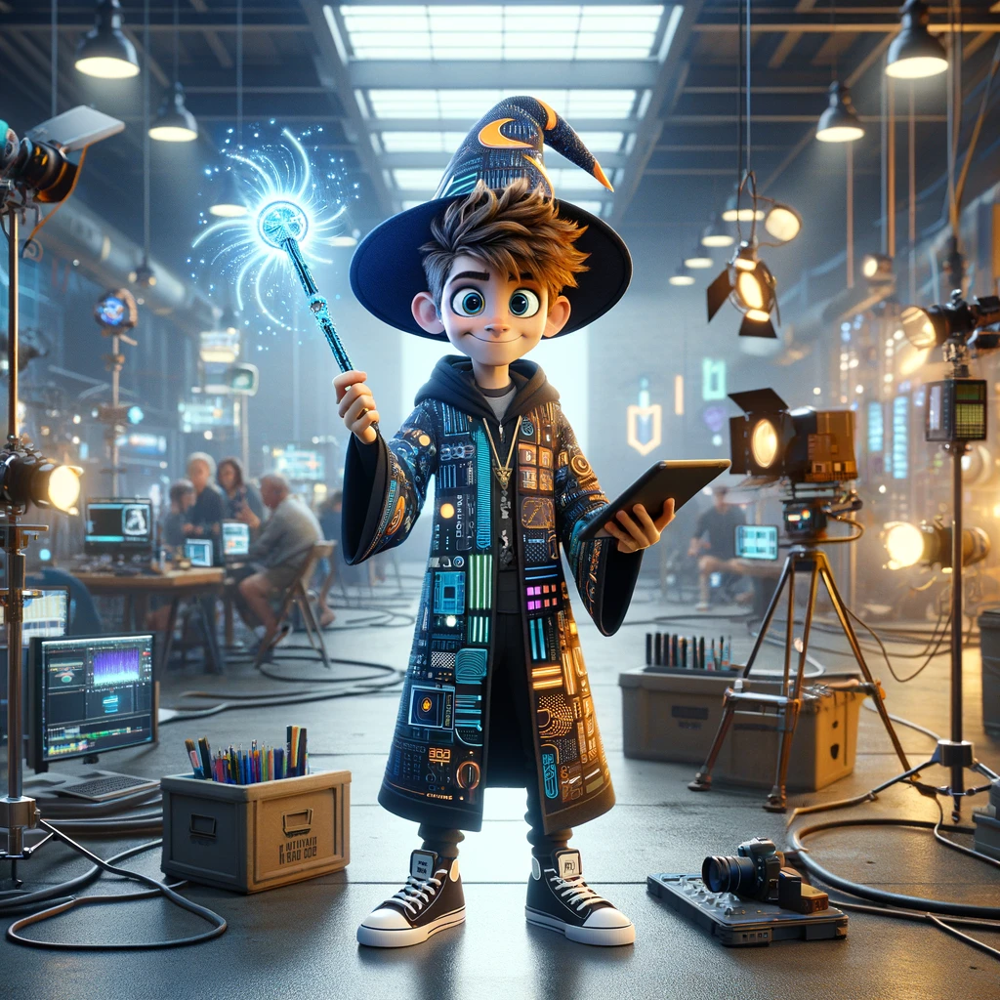
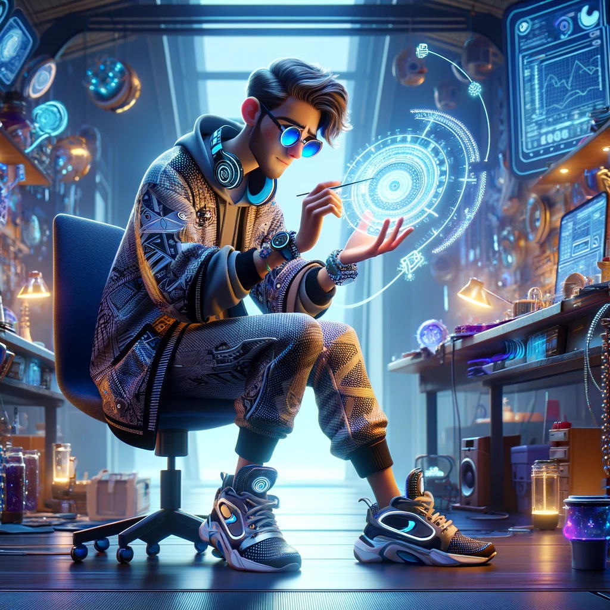
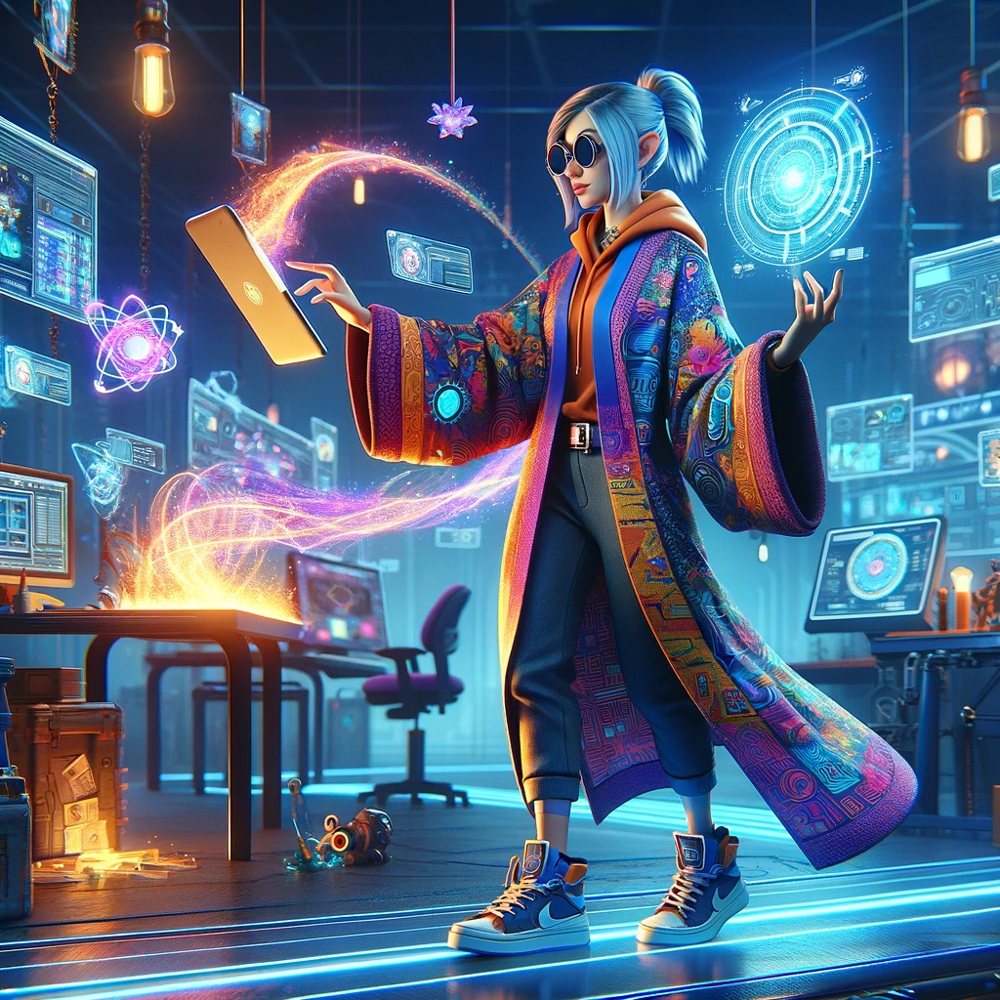
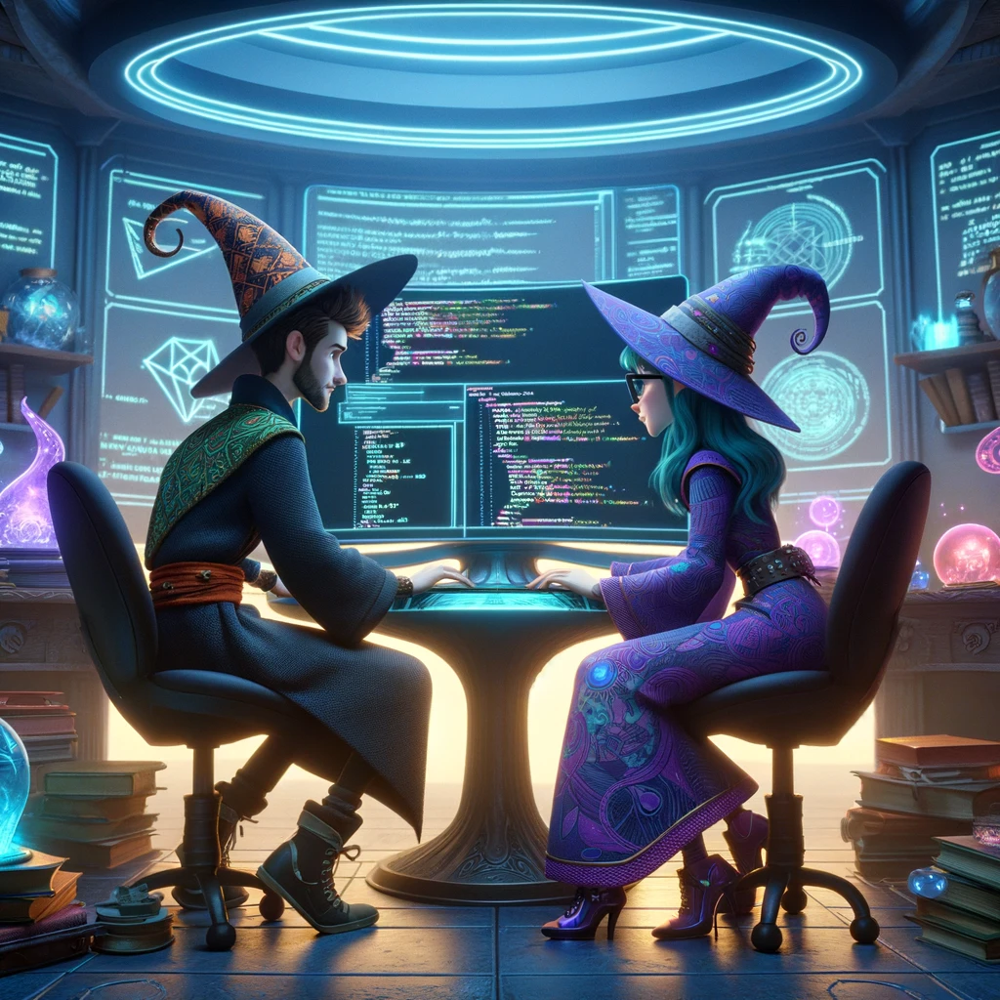
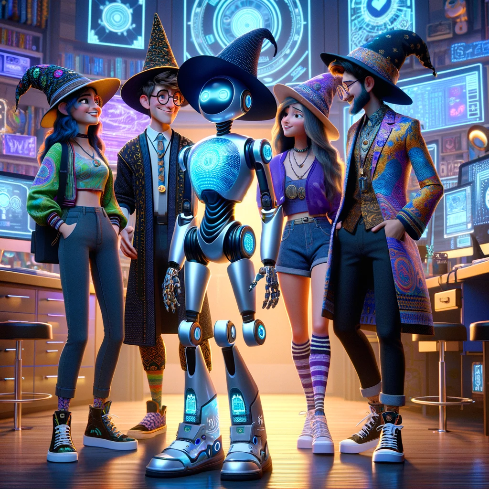

# What is Tech 
# Direction?

---

# Tech Directors 
## Make Tools

---

# Tech Directors 
## Work On Pipelines

---

# Tech Directors 
## Write Code

---

# Tech Directors
## Use AI

---

# My Background

---

# This Semester
# Two Kinds of Magic

## Blender Python
- Asset Pipeline
- Tool Creation
- Automation

---
# This Semester
# Two Kinds of Magic

## Unreal Engine

- AAA Production
- Feature Testing

---

# Week 1
## Programming Basics

- Github Copilot
- Blender Python
- VSCode

---

# Week 2
## Scripting in Blender

- Writing Good Functions
- Using LLMs
- Aninimating a cube in blender

---

# Week 3
## Advanced Scripting in Blender

- Animating a camera to follow an avatar

---

# Week 4
## Making our camera script in to a command line tool with Python

# Week 5
## Reality Capture

- Examining the process of scanning a toy with Apple Reality Capture, and optimizing the high-poly mesh for animation (UV, normal map baking, retopology)

---

# Week 6
## Writing a CLI tool that automates the mesh optimization process

---

# Week 7
## Github Actions

- Publishing our Tool to the Web With Github Actions

---

# Week 8
## Google Colab

- Publishing our Tool to the Web With Google Colab
---

# Week 10
## Intro to Unreal Engine

---

# Week 11
## Building Unreal Engine from source

---

# Week 12
## Reality Capture with Radiance Fields using Luma

---

# Week 13
## Radiance Fields in Unreal Engine Using Luma and Blender Geometry Nodes

---

# Week 14
## Final project proposals

- New feature tutorial for Unreal

---

# Week 15 
## Final project working session

--- 

# Week 16
## Final project presentations

